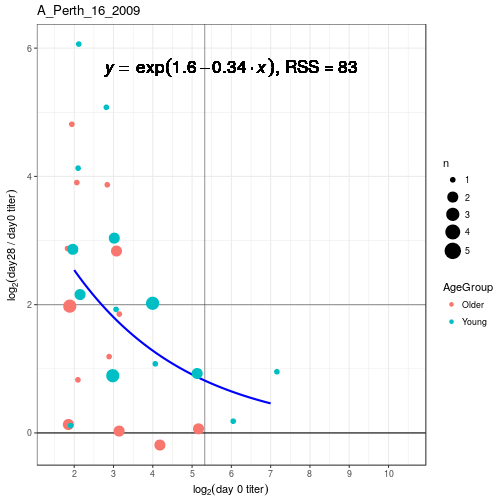

# titeR 

[](https://travis-ci.org/stefanavey/titeR)

## Overview

titeR is an R package for analysis and visualization of antibody titer data.  The intended use case is influenza antibody titer data measured by the hemagglutination inhibition assay (HAI).

## Installation

```r
library(devtools)
devtools::install_github("stefanavey/titeR")
```
