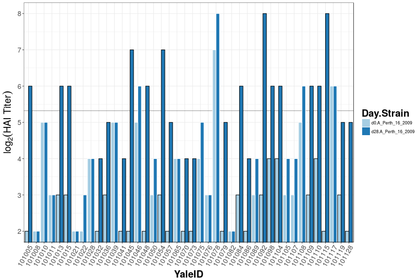
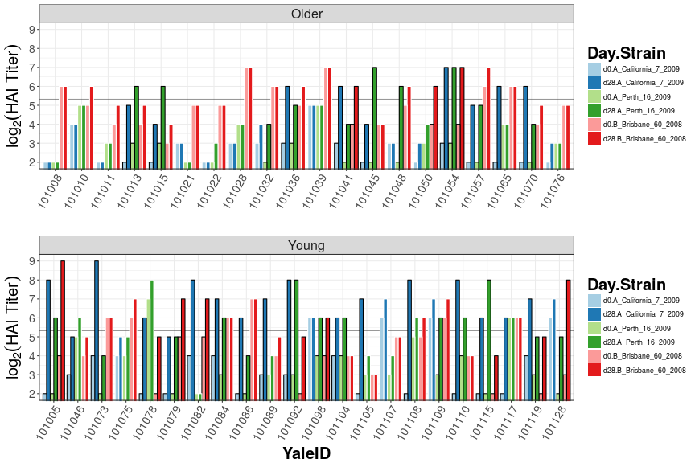
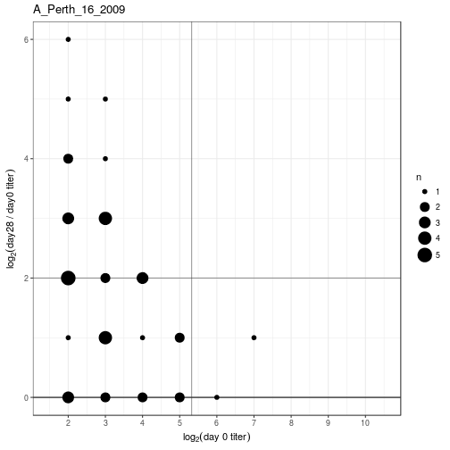

<!--
%\VignetteEngine{knitr}
%\VignetteIndexEntry{Visualize Titers}
-->


# Visualizing Titers


```r
library(titeR)

strains <- c("A_California_7_2009", "A_Perth_16_2009", "B_Brisbane_60_2008")
titer_list <- FormatTiters(Year1_Titers, strains,
                           subjectCol = "YaleID", otherCols = "AgeGroup")
```

## Bar plots

Bar plots can show the raw data, baseline and day 28 titer values for each subject.


```r
## Bar plot of B strain
Barplot(titer_list["A_Perth_16_2009"], subjectCol = "YaleID")
```



```r
## Bar plot of all strains
Barplot(titer_list, subjectCol = "YaleID", groupVar = "AgeGroup")
```



## Bubble Charts

Bubble Charts show the relationship between baseline titer and fold change. In general, a negative slope is observed.


```r
## Bubble Charts for all strains
BubbleChart(titer_list)
```


```r
## Bubble Chart for B strain
BubbleChart(titer_list["A_Perth_16_2009"])
```



```r
## Add an exponential fit and color by age group
BubbleChart(titer_list["A_Perth_16_2009"], fit = "exp",
            subjectCol = "YaleID", colorBy = "AgeGroup",
            eqSize = 6)
```


# Session Info


```r
sessionInfo()
```

```
## R version 3.3.1 (2016-06-21)
## Platform: x86_64-redhat-linux-gnu (64-bit)
## Running under: Fedora 24 (Workstation Edition)
## 
## locale:
##  [1] LC_CTYPE=en_US.UTF-8       LC_NUMERIC=C              
##  [3] LC_TIME=en_US.UTF-8        LC_COLLATE=en_US.UTF-8    
##  [5] LC_MONETARY=en_US.UTF-8    LC_MESSAGES=en_US.UTF-8   
##  [7] LC_PAPER=en_US.UTF-8       LC_NAME=C                 
##  [9] LC_ADDRESS=C               LC_TELEPHONE=C            
## [11] LC_MEASUREMENT=en_US.UTF-8 LC_IDENTIFICATION=C       
## 
## attached base packages:
## [1] stats     graphics  grDevices utils     datasets  methods   base     
## 
## other attached packages:
## [1] aveytoolkit_0.1.0.9026 ggplot2_2.2.0          knitr_1.15            
## [4] titeR_0.0.1.0015      
## 
## loaded via a namespace (and not attached):
##  [1] Rcpp_0.12.7        magrittr_1.5       munsell_0.4.3     
##  [4] colorspace_1.3-0   R6_2.2.0           stringr_1.1.0     
##  [7] highr_0.6          plyr_1.8.4         dplyr_0.5.0       
## [10] caTools_1.17.1     tcltk_3.3.1        tools_3.3.1       
## [13] grid_3.3.1         gtable_0.2.0       KernSmooth_2.23-15
## [16] DBI_0.5-1          gtools_3.5.0       lazyeval_0.2.0    
## [19] assertthat_0.1     digest_0.6.10      tibble_1.2        
## [22] reshape2_1.4.2     tidyr_0.6.0        bitops_1.0-6      
## [25] evaluate_0.10      mime_0.5           labeling_0.3      
## [28] gdata_2.17.0       limma_3.30.3       stringi_1.1.2     
## [31] compiler_3.3.1     gplots_3.0.1       scales_0.4.1      
## [34] markdown_0.7.7
```
